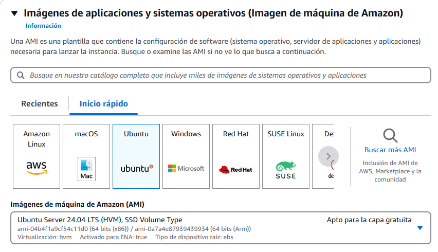
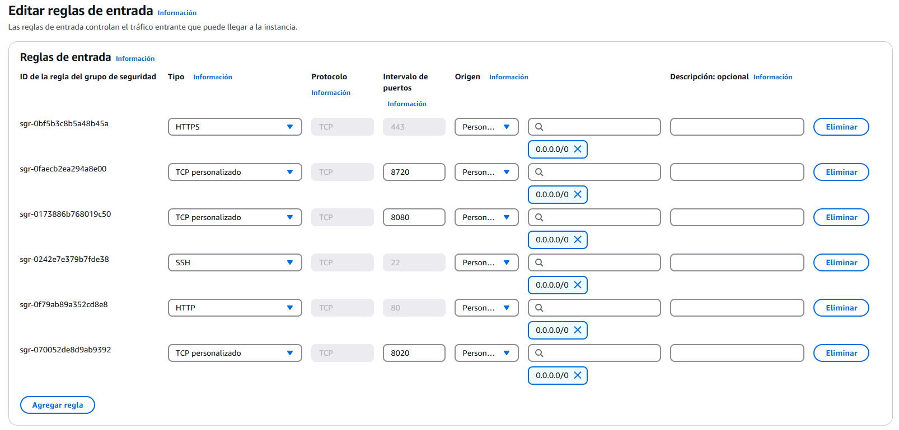
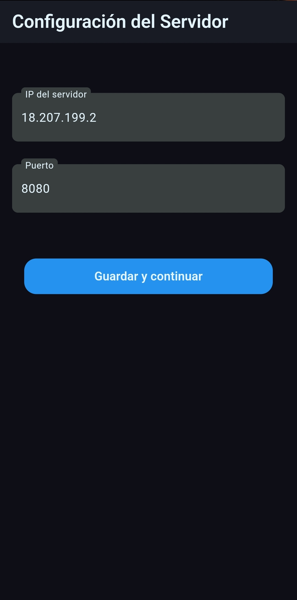
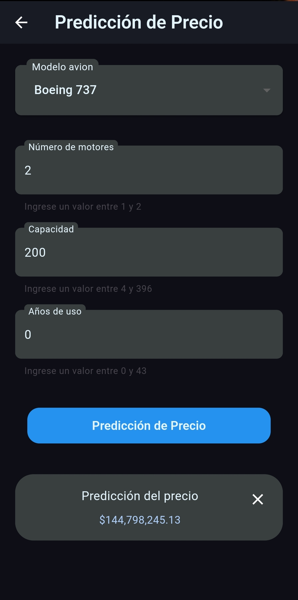

# Ejercicio IA Backend y Móvil (airplane_price)

## Objetivo

Desarrollar una aplicación móvil para Android que capture una serie de parámetros a través de un formulario. Estos parámetros se enviarán a un servidor Backend alojado en AWS EC2 mediante una API REST. El servidor procesará los datos y, utilizando un modelo de Machine Learning, predecirá el precio de un avión. La respuesta con la predicción se enviará de vuelta a la aplicación móvil.

## Creación del Modelo

En el siguiente codelab, se explicará detalladamente el proceso de creación de un modelo de Machine Learning utilizando RandomForestRegressor. Se cubrirán todos los pasos, desde la limpieza de datos y el preprocesamiento, hasta el entrenamiento y la evaluación del modelo.

- [Lab: Proyecto Final IA - Airplane_price](https://colab.research.google.com/drive/1Xtt6hKNzODoHvEsJt3jmZS_nJFzLUrBV?usp=sharing)


## Pasos a seguir

### Configuración del Servidor (AWS EC2)
1. Configurar una instancia de AWS EC2 con los permisos adecuados.
2. Instalar las dependencias necesarias para el servidor Backend.
3. Implementar la API REST para recibir los datos del formulario.
4. Integrar el modelo de Machine Learning para la predicción de precios.
5. Probar la API con herramientas como Postman o Curl.

### Configuración del Frontend (Flutter)
1. Configurar un proyecto Flutter para Android.
2. Diseñar el formulario de entrada de datos.
3. Implementar la comunicación con la API Backend.
4. Manejar los estados con Riverpod.
5. Mostrar los resultados de la predicción en la UI.

---

# Configuración del Backend en AWS EC2

## Introducción

Dado que el precio de un avión depende de múltiples factores con posibles interacciones y relaciones no lineales (por ejemplo, el impacto de la edad, el tipo de motor y el mantenimiento en el precio puede no ser lineal), Random Forest es una excelente opción para la predicción de precios.

Este documento proporciona una guía paso a paso para configurar un servidor en AWS EC2 para alojar un modelo de Machine Learning utilizando Flask.

---

## Requisitos previos

Antes de comenzar, asegúrate de tener lo siguiente:
- Una cuenta de AWS activa.
- Un par de claves SSH para conectarte a la instancia EC2.
- Python 3 instalado en la instancia.
- Un modelo previamente entrenado en formato `.bin`.

---

## Instalación de bibliotecas necesarias

Para que el servidor funcione correctamente, necesitas instalar las siguientes bibliotecas:

```sh
pip install Flask joblib numpy
```

### Explicación de las bibliotecas

- `Flask`: Microframework para Python que permite crear aplicaciones web de manera sencilla.
- `request`: Permite acceder a los datos de la solicitud HTTP.
- `jsonify`: Convierte los datos en formato JSON para las respuestas HTTP.
- `joblib`: Se utiliza para cargar modelos de Machine Learning previamente entrenados.
- `numpy`: Biblioteca para trabajar con arreglos y matrices de datos.

---

## Configuración de la instancia EC2 en AWS

1. **Lanzar una instancia EC2:**
   - Inicia sesión en la consola de AWS.
   - Ve a "EC2" y selecciona "Launch Instance".
   - Elige "Ubuntu" como sistema operativo.
   - Configura el tamaño de la instancia (recomendada: t2.medium o superior si el modelo es pesado).



2. **Configurar reglas de seguridad:**
   - Abre el puerto 8080 (o el que usará tu API) en el grupo de seguridad.
   - Habilita SSH (puerto 22) para acceder a la instancia.



3. **Conectarse a la instancia EC2:**
   - Usa SSH para conectarte a la instancia:
     
   ```sh
   ssh -i "tu_clave.pem" ubuntu@<tu_ip_ec2>
   ```

4. **Instalar Python y virtualenv:**
   
   ```sh
   sudo apt update && sudo apt install -y python3-pip python3-venv
   ```

5. **Crear y activar un entorno virtual:**
   
   ```sh
   python3 -m venv venv
   source venv/bin/activate
   ```

---

## Carga del modelo en la instancia

Para cargar el modelo entrenado y su scaler, utiliza SCP para transferirlos a la instancia EC2:

```sh
scp -i tu_clave.pem scalerairlane.bin modelo_airplane.bin ubuntu@<tu_ip_ec2>:~/
```

---

## Código del servidor

Guarda el siguiente código como `app.py` en tu instancia:

```python
from flask import Flask, request, jsonify
import joblib
import numpy as np

# Cargar el modelo y el scaler
model = joblib.load('modelo_airplane.bin')
scaler = joblib.load('scalerairlane.bin')

app = Flask(__name__)

@app.route('/predict', methods=['POST'])
def predict():
    try:
        # Obtener datos de la solicitud
        data = request.json
        
        # Validar datos de entrada
        required_fields = ['model', 'num_engines', 'capacity', 'age']
        for field in required_fields:
            if field not in data:
                return jsonify({'error': f'Campo requerido {field} no encontrado'}), 400
        
        # Convertir datos a numpy array
        features = np.array([[data['model'], data['num_engines'], data['capacity'], data['age']]])
        
        # Escalar características
        features_scaled = scaler.transform(features)
        
        # Realizar predicción
        prediction = model.predict(features_scaled)
        
        return jsonify({'predicted_price': prediction[0]})
    
    except Exception as e:
        return jsonify({'error': f'Error inesperado: {str(e)}'}), 500

if __name__ == '__main__':
    app.run(host='0.0.0.0', port=8020)
```

---

## Ejecutar el servidor

Para iniciar el servidor Flask, ejecuta:

```sh
python app.py
```

---

## Solución de errores

### Error de memoria insuficiente

Si al ejecutar el servidor recibes un error de memoria, intenta liberar cachés con:

```sh
sudo sync; sudo sysctl -w vm.drop_caches=3
```

---

## Prueba del API con Postman

Para probar el endpoint de predicción:

1. Abre Postman y crea una nueva solicitud `POST`.
2. Usa la siguiente URL:
   
   ```
   http://<tu_ip_publica>:8080/predict/
   ```

3. En la pestaña "Body", selecciona `raw` y usa el siguiente JSON:

   ```json
   {
     "model": 4,
     "num_engines": 2,
     "capacity": 50,
     "age": 36
   }
   ```

4. Envía la solicitud y verifica la respuesta JSON con la predicción del precio.

---
# Configuración del Proyecto Android

Este proyecto es un punto de partida para una aplicación Flutter.

Algunas referencias útiles para comenzar con Flutter:

- [Lab: Escribe tu primera aplicación en Flutter](https://docs.flutter.dev/get-started/codelab)
- [Cookbook: Ejemplos útiles en Flutter](https://docs.flutter.dev/cookbook)

Para obtener ayuda con el desarrollo en Flutter, visita la
[documentación en línea](https://docs.flutter.dev/), donde encontrarás tutoriales, ejemplos, guías sobre desarrollo móvil y una referencia completa de la API.

## Instalación

Para la instalación de Flutter, puedes consultar la documentación oficial:
- [Cómo instalar Flutter](https://docs.flutter.dev/get-started/install)

Para este proyecto se usaron las siguientes versiones:

- `DevTools 2.28.5`
- `Flutter 3.16.9`
- `Dart 3.2.6`

Asegúrate de tener Flutter instalado en tu sistema. Puedes verificarlo con el siguiente comando:

```sh
flutter --version
```

Para instalar las dependencias, ejecuta:

```sh
flutter pub get
```

## Versión de Java

La versión de Java utilizada en este proyecto es la **1.8.0_281**.

Para verificar la versión de Java utilizada en el proyecto, puedes revisar el archivo `build.gradle` en la sección `compileOptions`:

```groovy
android {
    compileOptions {
        sourceCompatibility JavaVersion.VERSION_1_8
        targetCompatibility JavaVersion.VERSION_1_8
    }
}
```

También puedes verificar la versión de Java instalada en tu sistema ejecutando el siguiente comando en la terminal:

```sh
java -version
```

## Dependencias adicionales

Este proyecto incluye las siguientes dependencias adicionales que no vienen por defecto en un nuevo proyecto de Flutter:

| Paquete                  | Versión  | Descripción | Instalación |
|--------------------------|-----------|-------------|--------------|
| flutter_riverpod         | ^2.4.9    | Manejo de estado basado en Riverpod. | `flutter pub add flutter_riverpod` |
| riverpod_annotation      | ^2.3.3    | Anotaciones para usar Riverpod con generación de código. | `flutter pub add riverpod_annotation` |
| dio                      | ^5.4.0    | Cliente HTTP avanzado para Dart. | `flutter pub add dio` |
| dartz                    | ^0.10.1   | Programación funcional en Dart. | `flutter pub add dartz` |
| intl                     | ^0.17.0   | Manejo de internacionalización y fechas. | `flutter pub add intl` |
| freezed_annotation       | ^2.0.0    | Anotaciones para clases inmutables con `freezed`. | `flutter pub add freezed_annotation` |
| dropdown_button2         | ^2.3.9    | Un dropdown personalizado para Flutter. | `flutter pub add dropdown_button2` |
| cupertino_icons          | ^1.0.2    | Iconos estilo iOS. | `flutter pub add cupertino_icons` |
| lottie                   | ^3.1.3    | Soporte para animaciones Lottie en Flutter. | `flutter pub add lottie` |
| flutter_launcher_icons   | ^0.13.1   | Personaliza los íconos de la aplicación. | `flutter pub add flutter_launcher_icons` |

### Dependencias de desarrollo

| Paquete                 | Versión  | Descripción | Instalación |
|-------------------------|-----------|-------------|--------------|
| build_runner           | ^2.4.6    | Herramienta para generación de código. | `flutter pub add build_runner --dev` |
| freezed                | ^2.0.0    | Generador de clases inmutables. | `flutter pub add freezed --dev` |
| riverpod_generator     | ^2.3.3    | Generador de código para Riverpod. | `flutter pub add riverpod_generator --dev` |
| flutter_lints          | ^2.0.0    | Conjunto de reglas de linting recomendadas. | `flutter pub add flutter_lints --dev` |

## Configuración de Iconos

Para generar los íconos de la aplicación, usa el siguiente comando:

```sh
flutter pub run flutter_launcher_icons:main
```
---

## Funcionamiento de la Aplicación

### **Pantalla de Configuración del Servidor**

En la primera pantalla, el usuario debe ingresar la IP y el puerto del servidor backend en AWS EC2. Esto es necesario porque la IP pública del servidor puede cambiar al reiniciarlo. La pantalla incluye:

- **Dos campos de entrada de texto (TextField)** para la IP y el puerto del servidor.
- **Un botón de navegación**, que permanecerá deshabilitado hasta que ambos campos estén correctamente llenos.

📷 _Ejemplo visual:_



### **Pantalla de Predicción**

Una vez configurado el servidor, la aplicación navega a la pantalla de predicción, donde el usuario ingresa los datos del avión. La pantalla incluye:

- **Un dropdown para seleccionar el modelo del avión.**
- **Tres campos de texto (TextField) para ingresar:**
  - Número de motores.
  - Capacidad de pasajeros.
  - Años de uso.
- **Validaciones en los campos de texto**, restringiendo los valores según los datos con los que fue entrenado el modelo de Machine Learning. Si el usuario ingresa valores fuera del rango permitido, se mostrará un mensaje de error.
- **Un botón para enviar los datos**, que permanecerá deshabilitado hasta que todos los campos sean llenados correctamente y sin errores.
- **El resultado de la predicción**, que aparecerá debajo del botón una vez que se reciba la respuesta del servidor.

📷 _Ejemplo visual:_




### **Validación de Rangos**

Cada campo de entrada tiene valores mínimos y máximos determinados por los datos con los que fue entrenado el modelo de Machine Learning. Esto es importante porque los modelos de aprendizaje automático tienen un **rango de generalización**, lo que significa que si intentamos hacer predicciones con valores fuera de estos rangos, el resultado podría ser inexacto o inválido.

📌 _Ejemplo: Si el campo "Años de uso" solo permite valores entre 0 y 43, e ingresamos 44, se mostrará un mensaje de error._

---

## Consejos

Si tienes problemas con los providers o necesitas regenerar código, puedes ejecutar:

```sh
dart pub run build_runner watch
```


---
Si tienes alguna pregunta o sugerencia, no dudes en contactarme. 🚀


